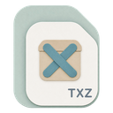
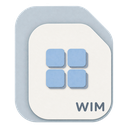

<div align="center">


# 轻压 · QZip

**一款本地优先、Windows 优先的轻量桌面压缩工具。**

拖入文件，即刻完成压缩、解压与压缩包浏览；将复杂选项留给需要它们的人。

`Windows 10 / 11 x64` · `v1.0.0` · `Apache-2.0`

[**下载最新版本**](https://github.com/isunky/QZip/releases/latest) · [查看更新记录](CHANGELOG.md) · [阅读已知问题](KNOWN_ISSUES.md)

</div>

<p align="center">
  
</p>

> QZip `v1.0.0` 正式支持 Windows 10/11 x64。若当前 Release 标记为 `unsigned-degraded`，Windows 可能显示“未知发布者”或 SmartScreen 提示，但应用界面、核心压缩功能、“打开方式/QZip”和文件关联仍可正常使用。

## 为什么是 QZip

| 简单开始 | 安心处理 | 一目了然 |
| :-- | :-- | :-- |
| 拖放文件或选择压缩包即可进入流程；常用场景使用合理默认值。 | 压缩采用临时文件提交，解压使用暂存目录合并，降低中断后留下损坏结果的风险。 | 从任务中心查看实时进度、完成结果与失败原因，并支持取消或重试。 |

- **本地优先**：文件在本机处理，不上传至服务端。
- **格式覆盖**：支持创建 `7Z`、`ZIP`、`TAR`、`TAR.GZ`、`TAR.XZ`，并读取、浏览和解压 `7Z`、`ZIP`、`RAR`、`TAR`、`TAR.GZ`、`TAR.XZ`、`GZ`、`XZ`、`BZ2`、`ISO`、`CAB`、`WIM`。
- **安全处理**：支持密码压缩/解压、7Z 文件名加密、完整性测试与安全写入。
- **Windows 集成**：面向 Windows 10/11 x64，提供文件关联与安装/卸载链路；受信任签名版本额外提供 Windows 11 Explorer 高频右键菜单。

## 支持的文件类型

以下图标与 QZip 的 Windows 文件关联和任务中心保持一致。标有“创建”的格式可用于新建压缩包；其余格式支持读取、浏览与解压。

<table>
  <tr align="center">
    <td width="25%"><br /><b>7Z</b><br /><code>.7z</code><br /><sub>创建 · 浏览 · 解压</sub></td>
    <td width="25%"><br /><b>ZIP</b><br /><code>.zip</code><br /><sub>创建 · 浏览 · 解压</sub></td>
    <td width="25%"><br /><b>TAR</b><br /><code>.tar</code><br /><sub>创建 · 浏览 · 解压</sub></td>
    <td width="25%"><br /><b>TGZ / TAR.GZ</b><br /><code>.tgz</code> · <code>.tar.gz</code><br /><sub>创建 · 浏览 · 解压</sub></td>
  </tr>
  <tr align="center">
    <td><br /><b>TXZ / TAR.XZ</b><br /><code>.txz</code> · <code>.tar.xz</code><br /><sub>创建 · 浏览 · 解压</sub></td>
    <td><br /><b>RAR</b><br /><code>.rar</code><br /><sub>浏览 · 解压</sub></td>
    <td><br /><b>GZ</b><br /><code>.gz</code><br /><sub>浏览 · 解压</sub></td>
    <td><br /><b>XZ</b><br /><code>.xz</code><br /><sub>浏览 · 解压</sub></td>
  </tr>
  <tr align="center">
    <td><br /><b>BZ2</b><br /><code>.bz2</code><br /><sub>浏览 · 解压</sub></td>
    <td><br /><b>ISO</b><br /><code>.iso</code><br /><sub>浏览 · 解压</sub></td>
    <td><br /><b>CAB</b><br /><code>.cab</code><br /><sub>浏览 · 解压</sub></td>
    <td><br /><b>WIM</b><br /><code>.wim</code><br /><sub>浏览 · 解压</sub></td>
  </tr>
  <tr align="center">
    <td colspan="4"><br /><b>通用归档</b><br /><sub>未知或其他归档格式的回退图标</sub></td>
  </tr>
</table>

## 界面一览

<table>
  <tr>
    <td width="50%"><br /><sub><b>创建压缩包</b> · 格式、压缩方式与密码按需配置</sub></td>
    <td width="50%"><br /><sub><b>解压压缩包</b> · 选择目标目录并处理同名文件</sub></td>
  </tr>
  <tr>
    <td width="50%"><br /><sub><b>浏览内容</b> · 在解压前先查看归档内的文件</sub></td>
    <td width="50%"><br /><sub><b>任务中心</b> · 集中追踪进行中、已完成与失败任务</sub></td>
  </tr>
</table>

## 快速开始

### 开发环境

| 工具 | 版本 |
| :-- | :-- |
| Node.js | `24.x` |
| pnpm | `11.9.0` |
| Rust | `1.96`（MSVC 工具链） |

```bash
pnpm install
pnpm dev
```

仅启动前端：

```bash
pnpm dev:web
```

## 常用命令

| 目标 | 命令 |
| :-- | :-- |
| 检查代码质量、测试与 Web 构建 | `pnpm check` |
| 拉取 7-Zip Sidecar（Windows x64） | `pnpm sidecar:fetch` |
| 校验 Sidecar 的文件与 SHA-256 | `pnpm sidecar:verify` |
| 验证 7Z 创建、列表、测试、解压与 Unicode 路径 | `pnpm sidecar:test` |
| 查看开发者能力入口 | `cargo run -p qzip-cli -- capabilities` |
| 构建 Windows 安装包 | `pnpm tauri:bundle:windows` |

Windows 打包前须先执行 `pnpm sidecar:fetch`。普通开发和 CI 构建不会启用该二进制资源映射，因此无需下载 Sidecar。

## 项目结构

```text
apps/                 桌面端与开发者 CLI
crates/               压缩后端、安全写入、任务运行时与平台集成
packages/             前端 UI 与共享代码
native/windows/       Windows Shell 与系统集成
scripts/              Sidecar、打包与发布校验脚本
PIC/                  产品界面设计图
docs/                 补充文档
```

## 质量与发布

- `pnpm check` 会依次运行 ESLint、TypeScript、前端测试、Web 构建、Rust 格式检查、Clippy 与 Rust 测试。
- 普通提交只运行 Windows CI。NSIS 安装包通过 GitHub Actions 手动构建；`build-only` 仅上传内测产物，`publish` 在签名凭据有效时发布可信签名版，否则自动发布干净的 `unsigned-degraded` 降级版。
- 取得代码签名 PFX 后，可在本机运行 `powershell.exe -NoProfile -ExecutionPolicy Bypass -File scripts/configure-github-signing.ps1 -PfxPath <PFX 路径>` 配置 GitHub Secrets。自签名证书仅用于内测，不可用于公开可信发布。
- `unsigned-degraded` 版本保留应用界面、核心压缩功能、“打开方式/QZip”和文件关联，但不安装 Windows 11 一级现代右键菜单；具体限制请参阅[已知问题](KNOWN_ISSUES.md)。
- 需求、验收与后续里程碑以[产品需求文档](QZip_PRD_V2.1.md)为权威来源。

## 文档

- [产品需求与验收](QZip_PRD_V2.1.md)
- [开发计划与完成状态](QZip_TODO_V2.1.md)
- [变更记录](CHANGELOG.md)
- [已知问题](KNOWN_ISSUES.md)
- [隐私说明](PRIVACY.md)
- [卸载说明](UNINSTALL.md)
- [依赖策略](DEPENDENCIES.md)
- [第三方许可证](THIRD_PARTY_LICENSES.md)

## 许可证

本项目采用 [Apache License 2.0](LICENSE) 许可证。
