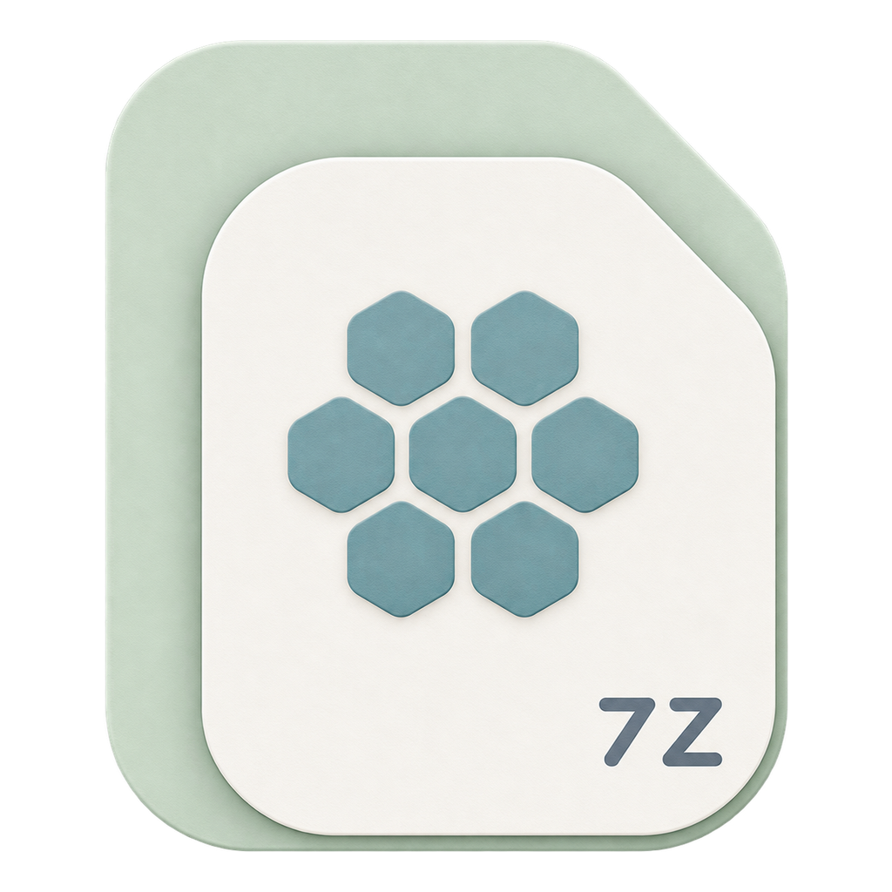
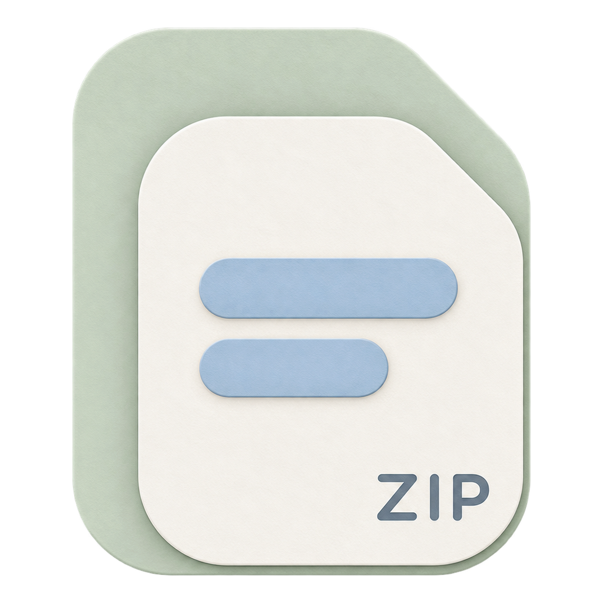
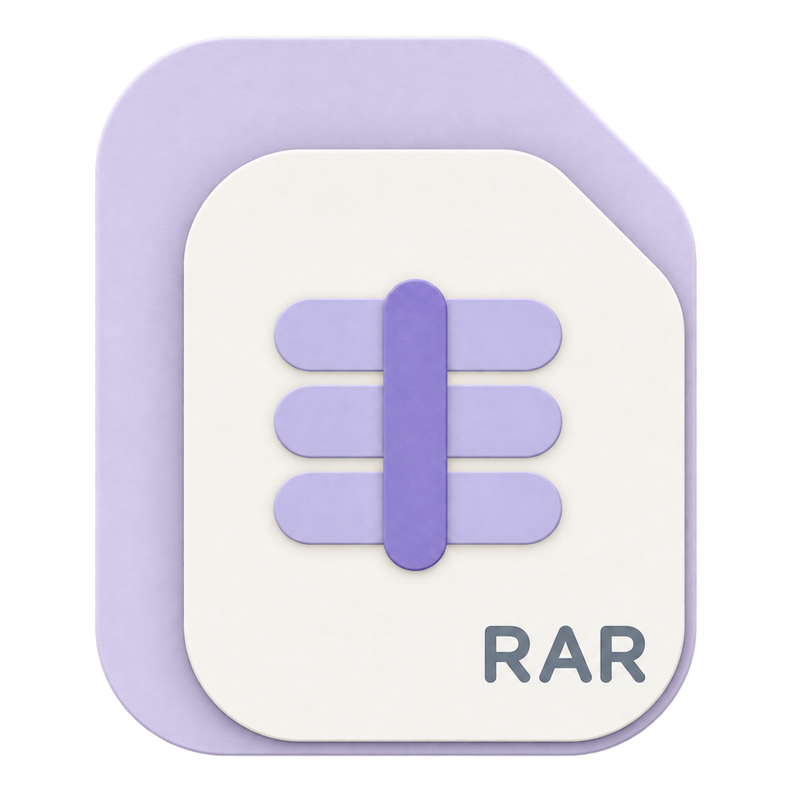
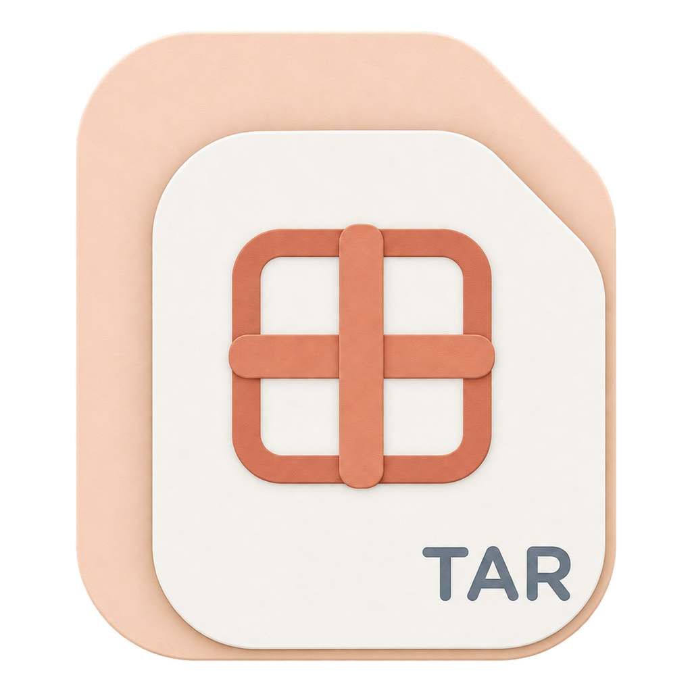
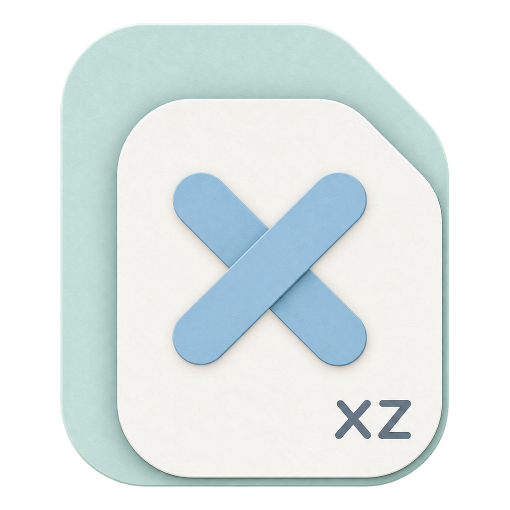
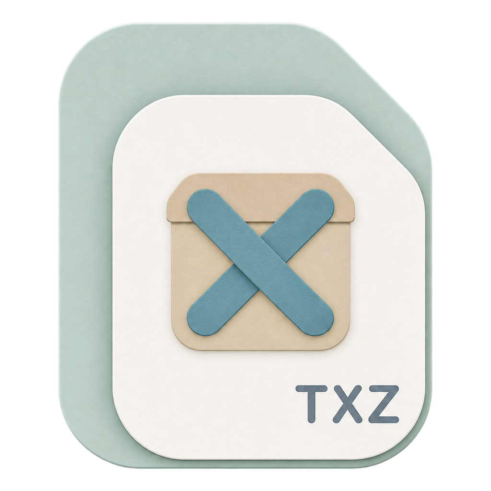
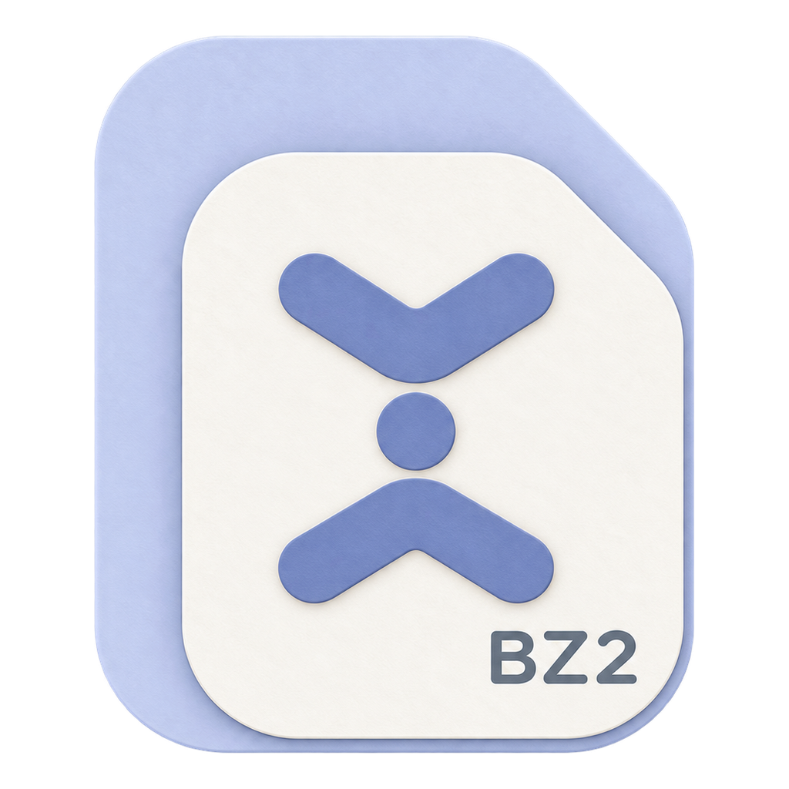
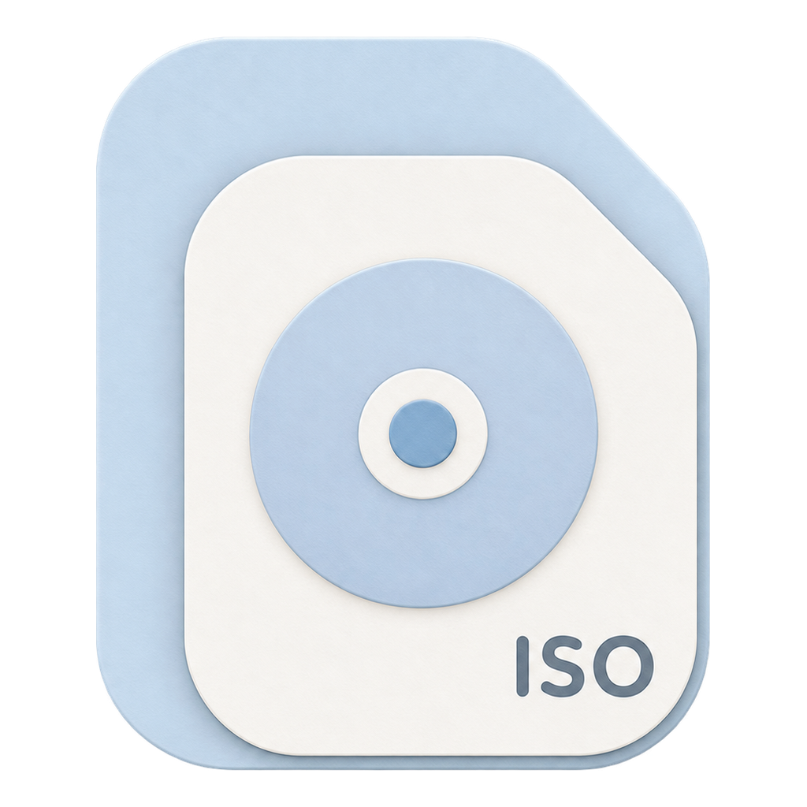
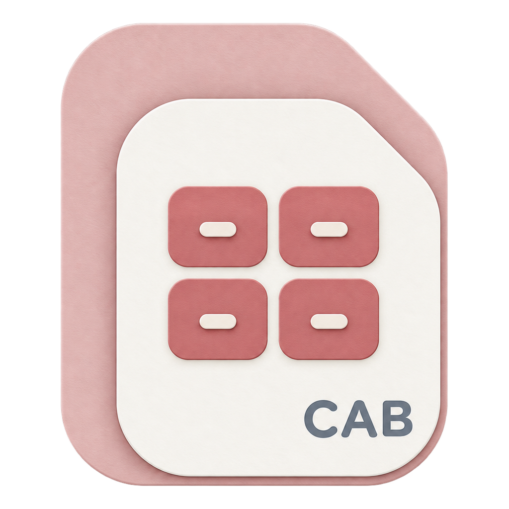
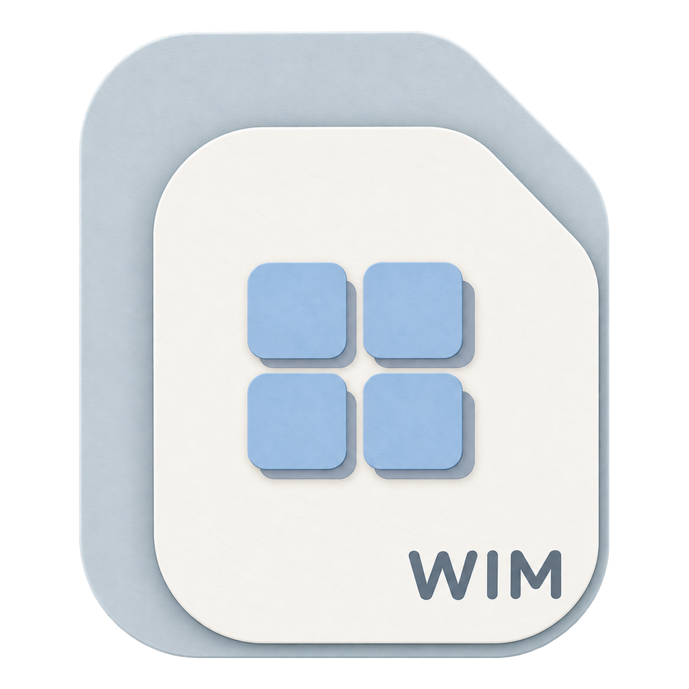

<div align="center">


# 轻压 · QZip

**免费无广告，好用也好看。**

从压缩到解压，每一步都简单清爽。

`Windows 10 / 11 x64` · `免费开源` · `无广告`

[**下载最新版本**](https://github.com/isunky/QZip/releases/latest) · [查看更新记录](CHANGELOG.md) · [阅读已知问题](KNOWN_ISSUES.md)

</div>

<p align="center">
  
</p>

## 为什么是 QZip

| 免费无广告 | 好看，也容易辨认 | 简单上手 |
| :-- | :-- | :-- |
| 所有核心功能均可免费使用，项目开源，没有广告和付费功能墙。 | 现代化界面搭配独立文件图标，让不同压缩格式一眼就能分清。 | 拖入文件即可开始，常用操作使用合适的默认设置，不必先研究复杂参数。 |
| **文件留在本机** | **解压前先看内容** | **任务进度更清楚** |
| 文件直接在电脑上处理，不需要上传到云端，更适合个人资料和办公文件。 | 可以先浏览、搜索压缩包中的文件，确认内容后再决定解压到哪里。 | 压缩和解压任务集中展示，进度、结果和失败原因都能随时查看。 |

轻压还支持密码保护、7Z 文件名加密和压缩包完整性测试。任务中断或失败时，会尽量避免留下损坏的压缩包和不完整文件。

## 支持的文件类型

每种常见格式都有独立设计的文件图标。关联轻压后，在资源管理器中也能快速区分 ZIP、7Z、RAR、TAR、ISO 等文件。

<p align="center"></p>

- **创建压缩包**：`7Z`、`ZIP`、`TAR`、`TAR.GZ`、`TAR.XZ`
- **查看和解压**：`7Z`、`ZIP`、`RAR`、`TAR`、`TAR.GZ`、`TAR.XZ`、`GZ`、`XZ`、`BZ2`、`ISO`、`CAB`、`WIM`

## 界面一览

<table>
  <tr>
    <td width="50%"><br /><sub><b>创建压缩包</b> · 格式、压缩方式与密码按需配置</sub></td>
    <td width="50%"><br /><sub><b>解压压缩包</b> · 选择目标目录并处理同名文件</sub></td>
  </tr>
  <tr>
    <td width="50%"><br /><sub><b>浏览内容</b> · 在解压前先查看归档内的文件</sub></td>
    <td width="50%"><br /><sub><b>任务中心</b> · 集中追踪进行中、已完成与失败任务</sub></td>
  </tr>
</table>

## 下载与安装

轻压支持 Windows 10/11 x64，可以从 [GitHub Releases](https://github.com/isunky/QZip/releases/latest) 下载最新安装包。

> 如果当前 Release 标记为 `unsigned-degraded`，Windows 可能显示“未知发布者”或 SmartScreen 提示。应用界面、压缩解压、“打开方式/QZip”和文件关联仍可正常使用，但 Windows 11 一级现代右键菜单暂不可用。

## 开发者指南

<details>
<summary>展开开发、构建与发布说明</summary>

### 开发环境

| 工具 | 版本 |
| :-- | :-- |
| Node.js | `24.x` |
| pnpm | `11.9.0` |
| Rust | `1.96`（MSVC 工具链） |

```bash
pnpm install
pnpm dev
```

仅启动前端：

```bash
pnpm dev:web
```

### 常用命令

| 目标 | 命令 |
| :-- | :-- |
| 检查代码质量、测试与 Web 构建 | `pnpm check` |
| 拉取 7-Zip Sidecar（Windows x64） | `pnpm sidecar:fetch` |
| 校验 Sidecar 的文件与 SHA-256 | `pnpm sidecar:verify` |
| 验证 7Z 创建、列表、测试、解压与 Unicode 路径 | `pnpm sidecar:test` |
| 查看开发者能力入口 | `cargo run -p qzip-cli -- capabilities` |
| 构建 Windows 安装包 | `pnpm tauri:bundle:windows` |

Windows 打包前须先执行 `pnpm sidecar:fetch`。普通开发和 CI 构建不会启用该二进制资源映射，因此无需下载 Sidecar。

### 项目结构

```text
apps/                 桌面端与开发者 CLI
crates/               压缩后端、安全写入、任务运行时与平台集成
packages/             前端 UI 与共享代码
native/windows/       Windows Shell 与系统集成
scripts/              Sidecar、打包与发布校验脚本
PIC/                  产品界面设计图
docs/                 补充文档
```

### 质量与发布

- `pnpm check` 会依次运行 ESLint、TypeScript、前端测试、Web 构建、Rust 格式检查、Clippy 与 Rust 测试。
- 普通提交只运行 Windows CI。正式发布时在 GitHub Actions 中选择 `patch`、`minor` 或 `major`；工作流会自动同步版本号、创建版本提交、构建 NSIS 安装包并发布稳定 Release。签名凭据有效时发布可信签名版，否则自动发布干净的 `unsigned-degraded` 降级版。
- 取得代码签名 PFX 后，可在本机运行 `powershell.exe -NoProfile -ExecutionPolicy Bypass -File scripts/configure-github-signing.ps1 -PfxPath <PFX 路径>` 配置 GitHub Secrets。自签名证书仅用于内测，不可用于公开可信发布。
- `unsigned-degraded` 版本保留应用界面、核心压缩功能、“打开方式/QZip”和文件关联，但不安装 Windows 11 一级现代右键菜单；具体限制请参阅[已知问题](KNOWN_ISSUES.md)。
- 需求、验收与后续里程碑以[产品需求文档](QZip_PRD_V2.1.md)为权威来源。

</details>

## 文档

- [产品需求与验收](QZip_PRD_V2.1.md)
- [开发计划与完成状态](QZip_TODO_V2.1.md)
- [变更记录](CHANGELOG.md)
- [已知问题](KNOWN_ISSUES.md)
- [隐私说明](PRIVACY.md)
- [卸载说明](UNINSTALL.md)
- [依赖策略](DEPENDENCIES.md)
- [第三方许可证](THIRD_PARTY_LICENSES.md)

## 许可证

本项目采用 [Apache License 2.0](LICENSE) 许可证。
